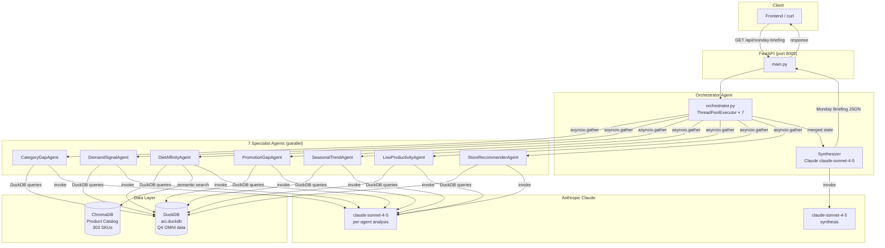
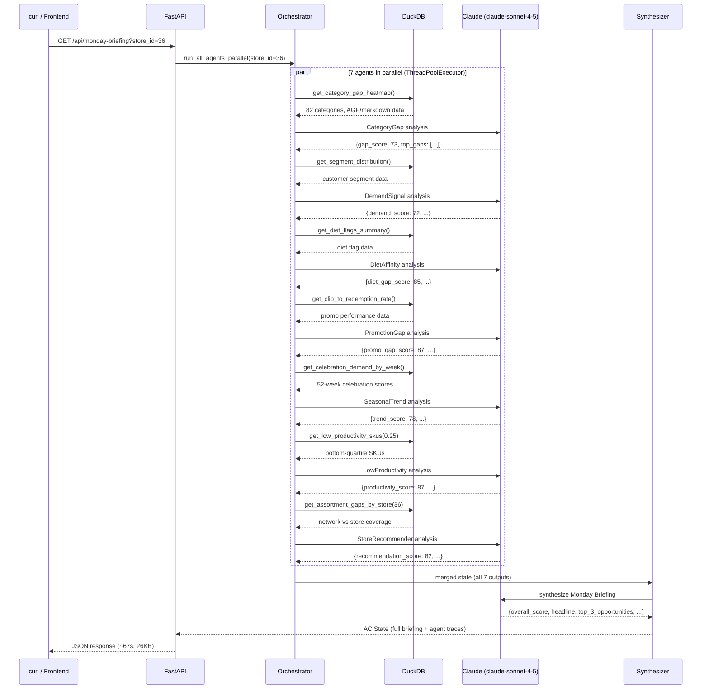
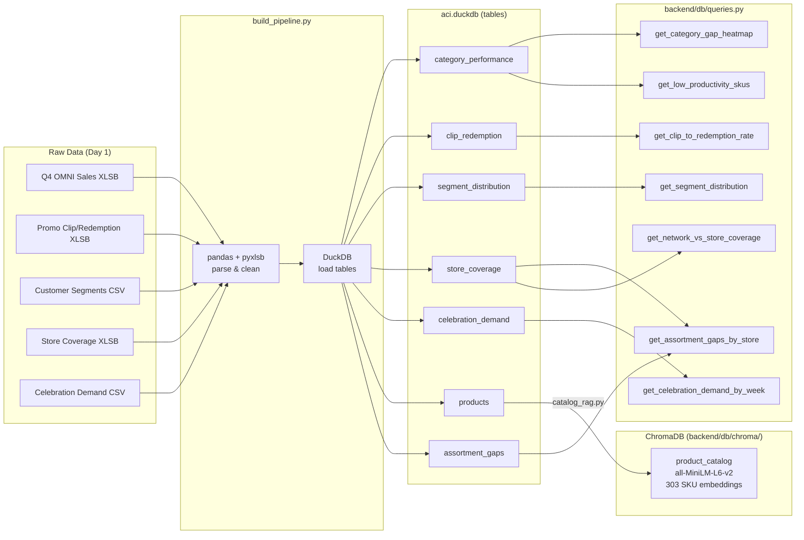

# ACI — Assortment Intelligence Platform

> **AI-powered Monday Morning Briefing for Albertsons Division 20 (Southern CA)**
>
> Seven specialist Claude agents run in parallel, analyse real Q4 OMNI retail data, and synthesise actionable assortment recommendations — all delivered in under 90 seconds.

---

## Table of Contents

- [Overview](#overview)
- [Architecture](#architecture)
- [Agent Pipeline Flow](#agent-pipeline-flow)
- [Data Flow](#data-flow)
- [API Endpoints](#api-endpoints)
- [Project Structure](#project-structure)
- [Quick Start](#quick-start)
- [Tech Stack](#tech-stack)

---

## Overview

ACI answers the question every category manager asks Monday morning: **"What do I need to fix, add, or drop this week?"**

It does this by running seven specialist AI agents in parallel — each analysing a different lens of the business — then synthesising their outputs into a single prioritised briefing with an overall health score, top 3 opportunities, top 3 risks, and concrete actions.

**Real results from Store 36 (Vons, Southern CA):**
- **Overall score:** 68/100 — "Needs Attention"
- **Headline:** *"You're leaving $142K on the table from broken SKUs while missing $480/week in proven winners"*
- **Top risk:** 4,438 coupons clipped, only 29 redeemed (0.7%) — catastrophic POS integration failure
- **Top opportunity:** Add Peet's French Roast + Illy Whole Bean for $305/week at 30% margin

---

## Architecture



---

## Agent Pipeline Flow



---

## Data Flow



---

## API Endpoints

| Endpoint | LLM | Latency | Description |
|----------|:---:|---------|-------------|
| `GET /api/health` | — | <100ms | DB connectivity check |
| `GET /api/briefing-summary` | — | <1s | Raw Monday snapshot (sales KPIs) |
| `GET /api/category-gap` | — | <1s | Gap heatmap for 82 categories |
| `GET /api/store-coverage` | — | <1s | Network vs store SKU coverage (15 stores) |
| `GET /api/store-recommendations/{id}` | — | <1s | Add/remove SKU candidates for a store |
| `GET /api/low-productivity-skus` | — | <1s | Bottom-quartile rationalization candidates |
| `GET /api/celebration-demand` | — | <1s | 52-week celebration purchase predictions |
| `GET /api/promo-performance` | — | <1s | Clip-to-redemption rates by banner |
| **`GET /api/monday-briefing`** | **✓** | **60-90s** | **Full AI briefing — all 7 agents + synthesis** |
| `GET /api/agents/{name}` | ✓ | 5-15s | Single agent in isolation |

**Agent names:** `category_gap` · `demand_signal` · `diet_affinity` · `promotion_gap` · `seasonal_trend` · `low_productivity` · `store_recommender`

Full curl examples and real responses → [`docs/api-reference.md`](docs/api-reference.md)

---

## Project Structure

```
hackathon/
├── build_pipeline.py          # Day 1: raw XLSB/CSV → aci.duckdb
├── aci.duckdb                 # DuckDB database (gitignored)
├── start_backend.sh           # Server launcher (sets ACI_DB_PATH)
├── docs/
│   └── api-reference.md       # Full curl playbook + real AI responses
│
└── backend/
    ├── main.py                # FastAPI app, all route handlers
    ├── requirements.txt       # Python dependencies
    ├── .env.example           # Environment variable template
    │
    ├── agents/
    │   ├── orchestrator.py    # Parallel fan-out + synthesis
    │   ├── category_gap.py    # Low-AGP / high-markdown categories
    │   ├── demand_signal.py   # Customer segment velocity trends
    │   ├── diet_affinity.py   # Diet flag gaps (GF, vegan, keto, dairy-free)
    │   ├── promotion_gap.py   # Clip-to-redemption failure analysis
    │   ├── seasonal_trend.py  # Celebration demand + Google Trends
    │   ├── low_productivity.py # Bottom-quartile SKU rationalization
    │   └── store_recommender.py # Network gap → store add/remove
    │
    ├── db/
    │   └── queries.py         # All DuckDB query functions
    │
    ├── rag/
    │   └── catalog_rag.py     # ChromaDB product catalog (semantic search)
    │
    └── tools/
        └── mcp_tools.py       # Action tools: pilot, flag, revenue estimate
```

---

## Quick Start

```bash
# 1. Clone and enter repo
git clone https://github.com/amrendrav/hackathon-4C.git
cd hackathon-4C

# 2. Build the database (requires raw data files in data/)
python build_pipeline.py

# 3. Install backend dependencies
pip install -r backend/requirements.txt

# 4. Configure environment
cp backend/.env.example backend/.env
# Edit backend/.env:
#   ANTHROPIC_API_KEY=sk-ant-...
#   ACI_DB_PATH=/absolute/path/to/aci.duckdb

# 5. (Optional) Build the RAG product catalog index
cd backend && python rag/catalog_rag.py && cd ..

# 6. Start the server
./start_backend.sh
# → Uvicorn running on http://127.0.0.1:8000

# 7. Verify
curl http://localhost:8000/api/health
# → {"status":"ok","service":"ACI","version":"2.0.0","db":"connected"}

# 8. Run Monday Briefing (requires ANTHROPIC_API_KEY)
curl "http://localhost:8000/api/monday-briefing?store_id=36" | python3 -m json.tool
```

---

## Tech Stack

| Layer | Technology |
|-------|-----------|
| **LLM** | Anthropic Claude (`claude-sonnet-4-5`) via `langchain-anthropic` |
| **Agent framework** | LangGraph `StateGraph` + `asyncio` ThreadPoolExecutor |
| **API** | FastAPI + Uvicorn |
| **Database** | DuckDB (analytical queries on Q4 OMNI retail data) |
| **Vector search** | ChromaDB + `all-MiniLM-L6-v2` sentence-transformers |
| **Data ingestion** | pandas + pyxlsb + openpyxl |
| **Trend data** | pytrends (Google Trends API fallback) |
| **Language** | Python 3.11+ |
